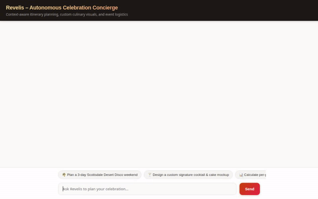
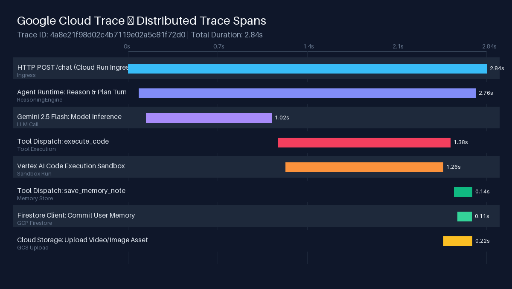

# Revelis – Autonomous Celebration Concierge

Revelis is an autonomous AI concierge designed for context-aware celebration itinerary planning, custom culinary visuals, media previews, and automated event logistics. Built with the **Agent Development Kit (ADK)** and deployed on **Google Cloud Agent Platform (Vertex AI Agent Engine)**, Revelis combines rich A2UI interactive cards, sandboxed Python code execution, long-term Firestore memory persistence, and multimodal Google Generative AI models.



---

## Architecture & Wired Tools

Revelis leverages a modular architecture powered by Google Cloud infrastructure and Gemini models. Below are the actual tools and services integrated in the codebase (`app/`):

### 1. Generative Visual & Media Tools
* **`generate_concept_image`**: Generates high-resolution culinary, cocktail, and event mockup images using **Imagen 3 (`imagen-3.0-generate-002`)**. Saves artifacts via ADK `ToolContext` and uploads image bytes to a public Google Cloud Storage bucket (`revelis-assets-d020ad`).
* **`generate_video_preview`**: Generates cinematic slow-motion video previews (e.g. signature cocktail pours or 360-degree celebration cake showcases) using **Google Omni (`gemini-omni-flash-preview`)** in the `global` region. Saves artifacts and returns public GCS HTTPS video URLs rendered as HTML5 video players.

### 2. Sandboxed Code Execution
* **`AgentEngineSandboxCodeExecutor`**: Executes dynamically generated Python code inside a secure Vertex AI agent sandbox. Used for precise per-person budget splits, tip/tax calculations, and complex financial allocations.

### 3. Long-Term Memory Bank (Firestore)
* **`PreloadMemoryTool` & `generate_memories_callback`**: Long-term state persistence backed by **Google Cloud Firestore** (`revelis-memories` collection). Automatically extracts and recalls user preferences, dietary needs, party sizes, and celebration themes across user sessions.

### 4. Itinerary & Event Logistics Tools
* **`get_itinerary` / `add_itinerary_item`**: Manages multi-day celebration schedules and event activities.
* **`get_menu_items` / `add_menu_item`**: Handles catering, dining, and signature bar menu customization.
* **`validate_and_generate_event_logistics`**: Validates party headcount, scheduling conflicts, and venue capacities.
* **`get_weather` / `get_destination_weather` / `get_current_time`**: Retrieves live destination weather forecasts and local time zone information.

### 5. Rich A2UI Interface Rendering
* **`a2ui_callback`**: Transforms model outputs into structured A2UI v0.8 card components (`Card`, `Column`, `Row`, `Text`, `Divider`, `Image`, `Icon`) for clean, interactive rendering in the web interface.

---

## Local Setup & Development

Follow these steps to run Revelis locally on your machine.

### Prerequisites
* Python 3.11+
* Google Cloud SDK (`gcloud`) authenticated with a GCP Project
* Vertex AI API and Firestore API enabled in your GCP project

### Installation

1. **Clone the Repository & Install Dependencies**:
   ```bash
   git clone <repository-url>
   cd revelis
   python3 -m venv .venv
   source .venv/bin/python
   pip install -r requirements.txt
   pip install -r frontend/requirements.txt
   ```

2. **Configure Environment Variables**:
   Set your GCP Project and Agent Engine resource ID:
   ```bash
   export GOOGLE_CLOUD_PROJECT="<YOUR_GCP_PROJECT_ID>"
   export GOOGLE_CLOUD_LOCATION="us-central1"
   export AGENT_ENGINE_RESOURCE_NAME="projects/<YOUR_PROJECT_NUMBER>/locations/us-central1/reasoningEngines/<REASONING_ENGINE_ID>"
   export AGENT_DIRECTORY="app"
   ```

3. **Start the Local Frontend Server**:
   ```bash
   cd frontend
   python3 main.py
   ```
   The local web application will be accessible on your configured port (default `8080`).

---

## Observability & Distributed Tracing

Revelis is fully instrumented with **OpenTelemetry** and integrated with **Google Cloud Trace** to deliver end-to-end distributed tracing across all request lifecycles.



### Trace Lifecycle & Span Waterfall:
1. **Cloud Run / Web Ingress**: Captures incoming HTTP requests from the chat UI (`POST /chat`), recording client latencies and request headers.
2. **Agent Platform Reasoning Engine**: Measures the prompt processing, context loading, and plan generation inside the ADK agent orchestration layer.
3. **Gemini 2.5 Flash Inference**: Tracks the exact LLM inference span (`Gemini 2.5 Flash`) and token processing latency.
4. **Tool Dispatch & Sandboxed Execution**: Records tool dispatch spans, including isolated code execution inside the **Vertex AI Code Execution Sandbox** (`AgentEngineSandboxCodeExecutor`).
5. **GCP Firestore & Cloud Storage Persistence**: Measures latency for long-term memory reads/writes to **Google Cloud Firestore** and media asset uploads to **Cloud Storage (GCS)**.
